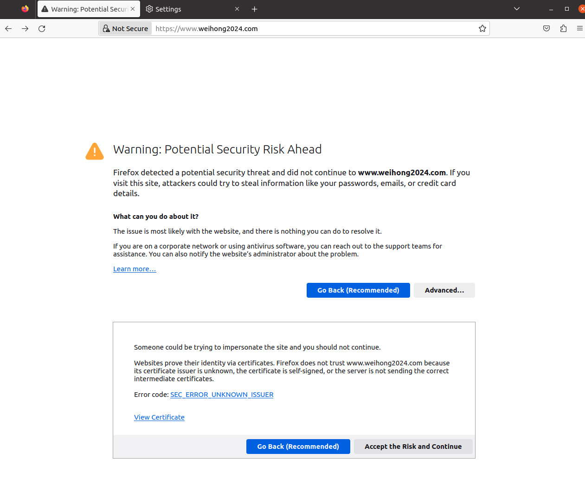
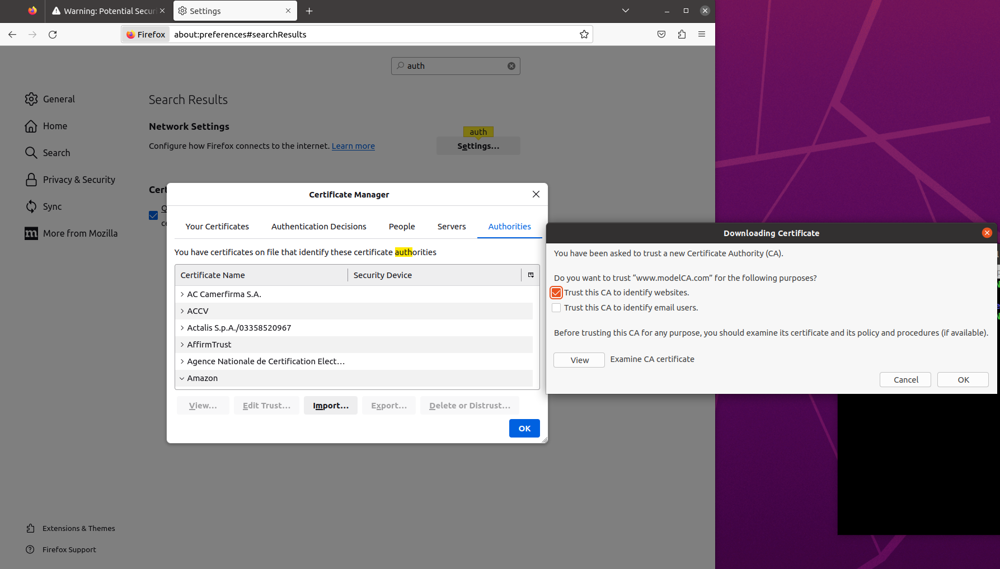
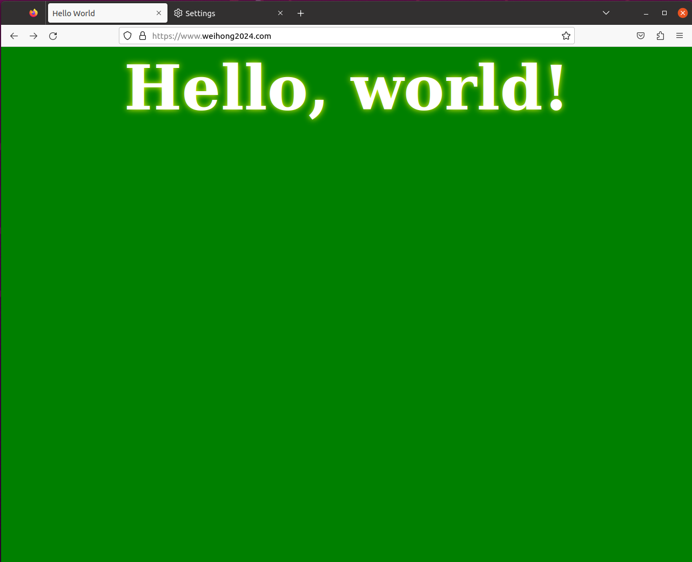
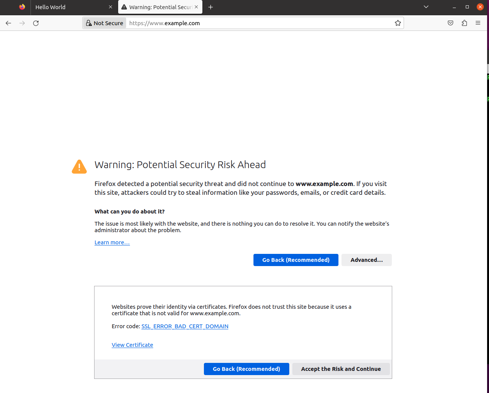
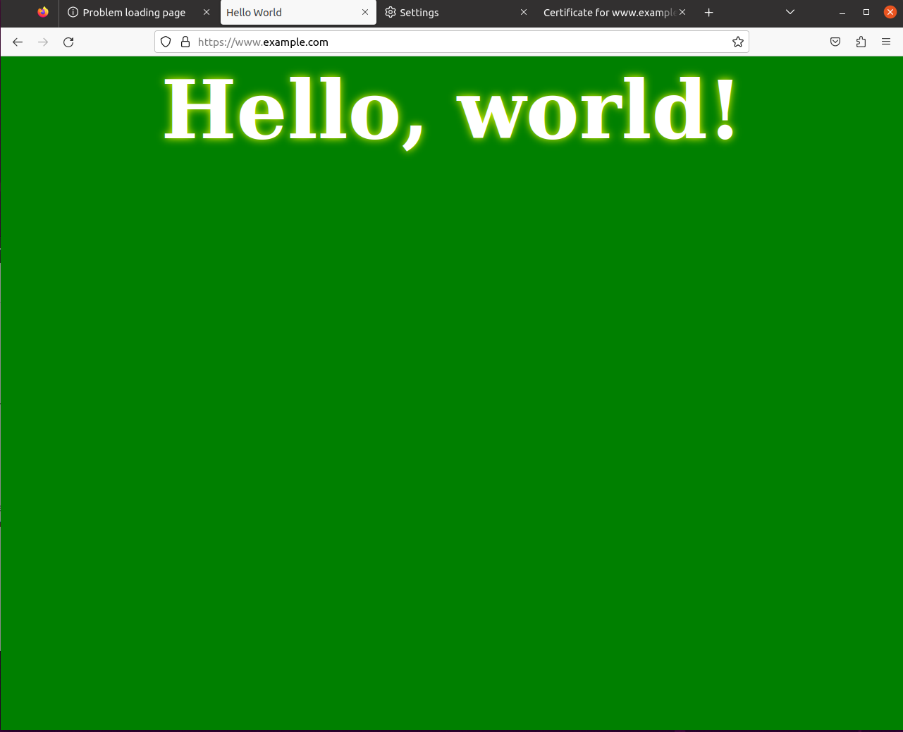

# Task1: Becoming a root CA

After running the command
```
openssl req -x509 -newkey rsa:4096 -sha256 -days 3650 \
            -keyout ca.key -out ca.crt  \
            -subj "/CN=www.modelCA.com/O=Model CA LTD./C=US" \
            -passout pass:dees
```
It will generate the two files: `ca.key` and `ca.crt`
1. `ca.key` file contains the `private key ` of the CA and is used to sign certificates for individual servers and clients.
2. `ca.crt` contains the `public certificate` information of the CA, which include things like the `public key`, `issuer`, `algorithm` to generate the signature...

Inspecting the `ca.crt` file using `openssl x509 -in ca.crt -text -noout` we can answer the following questions
- What part of the certificate indicates this is a CA's certificate
  - We can see from the `ca.crt` that there is a section named `X509v3 Basic Contstrins: critical` and follwing that `CA:TRUE` indicating that this is a CA's certificate
- What part of the certificate indicates this is a self-signed certificate?
  - We can see from the `Subject` and `Issuer` field of the `ca.crt` that they are both `CN = www.modelCA.com, O = Model CA LTD., C = US`, which means that they are issued and meant for the same entity and hence this is a `self-signed` certificate
- In the RSA algorithm, we have a public exponent e, a private exponent d, a modulus n, and two secret numbers p and q, such that n = pq. Please identify the values for these elements in your certificate and key files.
  - Public exponent `e` can be found in the `ca.crt` file, under a field `Subject Public Key Info > Public Key Algorithm > Exponent` which in this case is `65537`
  - The modulus `n` can be found can be found in the `ca.crt` file, under a field `Subject Public Key Info > Public Key Algorithm > Modulus`
  - The private exponent `d` can be found in the `ca.key` file under the field `private Exponent`
  - The two secret prime number `p` and `q` correspond to the two fields in the `ca.key` file, that is `prime1` and `prime2`

# Task 2: Generating a Certificate Request for Your Web Server
Before we can get a public key certificate from the CA, we need to generate a Certificate Signing Request(CSR) that includes the company's identity information for the CA to verify and generate the certificate

To generate a CSR, run the following command
```
openssl req -newkey rsa:2048 -sha256  \
            -keyout server.key   -out server.csr  \
            -subj "/CN=www.weihong2024.com/O=Bank32 Inc./C=US" \
            -passout pass:dees
```

You will get the follwing output:
```
Generating a RSA private key
...............+++++
...................................................+++++
writing new private key to 'server.key'
-----

```

To inspect the output file in plain text
```
openssl req -in server.csr -text -noout
openssl rsa -in server.key -text -noout
```

We can add Subject Alternative Name(SAN) to allow our certificate to have multiple names, to do that we modify the previous command to generate a CSR
```
openssl req -newkey rsa:2048 -sha256  \
            -keyout server.key   -out server.csr  \
            -subj "/CN=www.weihong2024.com/O=Bank32 Inc./C=US" \
            -passout pass:dees \
            -addext "subjectAltName=DNS:www.weihong2024.com, \
                                    DNS:www.weihong2024A.com, \
                                    DNS:www.weihong2024B.com" 
```
We will get the same output from the above

# Task 3 : Generating a Certificate for your server

After verifing the CSR file, the CA will proceed to generate the certificate using its own `private key` and `CA cert` generated in [Task 1] using the following command

```
openssl ca -config openssl.cnf -policy policy_anything \
           -md sha256 -days 3650 \
           -in server.csr -out server.crt -batch \
           -cert ca.crt -keyfile ca.key
```

We will have the following output
```
Using configuration from openssl.cnf
Enter pass phrase for ca.key:
Check that the request matches the signature
Signature ok
Certificate Details:
        Serial Number: 4660 (0x1234)
        Validity
            Not Before: Oct 13 14:24:10 2023 GMT
            Not After : Oct 10 14:24:10 2033 GMT
        Subject:
            countryName               = US
            organizationName          = Bank32 Inc.
            commonName                = www.weihong2024.com
        X509v3 extensions:
            X509v3 Basic Constraints:
                CA:FALSE
            Netscape Comment:
                OpenSSL Generated Certificate
            X509v3 Subject Key Identifier:
                8B:1C:C6:D0:E9:43:AC:5C:21:02:2B:7B:32:5B:20:2D:A6:D4:93:ED
            X509v3 Authority Key Identifier:
                keyid:ED:11:AC:CA:8C:DE:00:6D:B3:C6:C4:00:67:12:92:FE:41:C1:06:D4

Certificate is to be certified until Oct 10 14:24:10 2033 GMT (3650 days)

Write out database with 1 new entries
Data Base Updated

```
We can see that the newly generated certificate is meant for the `www.weihong2024.com`, but we can see that the alternative names that we added previously is not registered with the certificate. We will need to add `copy_extensions=copy` into our `openssl.cnf` file

We will need to delete the record of the previous certificate from the database since it is not what we wanted, to do that we can find the `database` in out `openssl.conf` file, and delete the relevant record. **Note that this is not recommended in actuval practice, you should use the `-revoke` flag to revoke the certificate, do make a backup before you delete**
You will get the following output
```
Using configuration from openssl.cnf
Enter pass phrase for ca.key:
Check that the request matches the signature
Signature ok
Certificate Details:
        Serial Number: 4661 (0x1235)
        Validity
            Not Before: Oct 13 14:42:24 2023 GMT
            Not After : Oct 10 14:42:24 2033 GMT
        Subject:
            countryName               = US
            organizationName          = Bank32 Inc.
            commonName                = www.weihong2024.com
        X509v3 extensions:
            X509v3 Basic Constraints:
                CA:FALSE
            Netscape Comment:
                OpenSSL Generated Certificate
            X509v3 Subject Key Identifier:
                8B:1C:C6:D0:E9:43:AC:5C:21:02:2B:7B:32:5B:20:2D:A6:D4:93:ED
            X509v3 Authority Key Identifier:
                keyid:ED:11:AC:CA:8C:DE:00:6D:B3:C6:C4:00:67:12:92:FE:41:C1:06:D4

            X509v3 Subject Alternative Name:
                DNS:www.weihong2024.com, DNS:www.weihong2024A.com, DNS:www.weihong2024B.com
Certificate is to be certified until Oct 10 14:42:24 2033 GMT (3650 days)

Write out database with 1 new entries
Data Base Updated

```
Now from the new output, we can see that the SANs that we specified earlier is applied

We can inspect the content of the certificate using
```openssl x509 -in server.crt -text -noout```
Under `Issuer` we can see that the certificate is issued by the `Model CA` and its meant for `www.weihong2024.com`

# Task 4 Deploying Certificate in a Apache-Based HTTPS Website
Now go into the container using `docksh <container-id>` and navigate to `/etc/apache2/sites-available` you should see a `bank32_apache_ssl.conf` with the necessary settings

On our own machine, we will need to move the `server.key` and `server.crt` that we generated previously into the `volumes` folder for the docker container to access

we will create a new file call `weihong2024_apache_ssl.conf` in the `volums` folder with the following content
```
<VirtualHost *:443>
    DocumentRoot /var/www/bank32
    ServerName www.weihong2024.com
    ServerAlias www.weihong2024A.com
    ServerAlias www.weihong2024B.com
DirectoryIndex index.html
SSLEngine On
SSLCertificateFile /volumes/server.crt
SSLCertificateKeyFile /volumes/server.key
</VirtualHost>
```
We can use the same `DocumentRoot`, which contains the content of the website, since we are not interested in the content that is being displayed but the `ssl`
We can the `ServerName` and `ServerAlias` to the ones that we have set previously for our certificate
we now point the `SSLCertificateKeyFile` to `/volums/server.key` file since it is where the share folder for docker and host machine and where the server key file lives (you can move it to elsewhere)
we now point the `SSLCertificateFile` to `/volums/server.crt` file

## Symlink
For `apache` to run our site, we need to symlink it to the sites-available folder Using
```
ln -s /volums/weihong2024_apache_ssl.conf /etc/apache2/sites-available/weihong2024_apache_ssl.conf
```

## Starting the server
Now We can enable `apache's ssl` modeule by `a2enmod ssl`

We will get the follwing output
```
root@weihong-1005610:/# a2enmod ssl
Considering dependency setenvif for ssl:
Module setenvif already enabled
Considering dependency mime for ssl:
Module mime already enabled
Considering dependency socache_shmcb for ssl:
Module socache_shmcb already enabled
Module ssl already enabled
```

We can now enable the site using `a2ensite bank32_apache_ssl`
```
root@weihong-1005610:/volumes# a2ensite weihong2024_apache_ssl
Site weihong2024_apache_ssl already enabled
```
We can start the server using `service apache2 start`
```
root@weihong-1005610:/volumes# service apache2 start
 * Starting Apache httpd web server apache2                                                                                                                                            Enter passphrase for SSL/TLS keys for www.weihong2024.com:443 (RSA):
 *
```

## Browsing the website
On first attempt we are warned that this site is not secured and we might be under a man in the middle attack

From the screenshot, we can tell that the error is coming from the browser not trusting the issuer of the cert, because it is self signed by our `Model CA`, since we know that this CA is trustable, we can add the public key of the CA to the broser so that the browser know that this is a trustable CA and hence allow us to access the sites that are behind the certificate that is signed by this CA

### Adding the CA's cert to the browser
We first need to find the browser preference, and search for `authorities` and import the `ca.crt` file and tick the option `Trust this CA to identify websites`


### Visit again
Reload `www.weihong2024.com` we are able to access the website using `https` which means our certificate is working


# Task 5: Launching Man in the Middle attack
## Setting up malicious website
Duplicate the `weihong2024_apache_ssl.conf` file and name it `example_apache_ssl.conf` and change the `ServerName` to `www.example.com`

### Output
```
root@weihong-1005610:/# cat /etc/apache2/sites-available/example_apache_ssl.conf
<VirtualHost *:443>
    DocumentRoot /var/www/bank32
    ServerName www.example.com
    ServerAlias www.weihong2024A.com
    ServerAlias www.weihong2024B.com
DirectoryIndex index.html
SSLEngine On
SSLCertificateFile /volumes/server.crt
SSLCertificateKeyFile /volumes/server.key
</VirtualHost>
```
## Enable the site
`a2ensite example_apache_ssl`

## Reload the apache2
`service apache2 restart`

## Adding the DNS
Adding the dns record for `www.example.com` to `/etc/hosts` on the host machine
`10.9.0.80 www.example.com`

## Browse the target website
We can see from the screenshot that the `Secure Connection failed,` This is because the certificate that we put in the `example_apache_ssl` file is meant for the common name `www.weihong2024.com` which does not match the website that we are visiting which is `www.example.com`


# Task 6 Launching MITM with a compromised CA

Since the CA is compromised, we can use the CA's certificate to sign a verified certificate that is recognised by the browser

## Signing a new certificate
We will use the CA's certificate and private key to sign a new certificate for `www.example.com`
We will repeat Task 2-4 
### Creating CSR
```
openssl req -newkey rsa:2048 -sha256  \
            -keyout example.key   -out example.csr  \
            -subj "/CN=www.example.com/O=Bank32 Inc./C=US" \
            -passout pass:dees \
            -addext "subjectAltName=DNS:www.example.com, \
                                    DNS:www.exampleA.com, \
                                    DNS:www.exampleB.com" 
```

### Generate a certificate
Since the CA's certificate is compromised, we can sign a `example.crt` using the CA's certificates
```
openssl ca -config openssl.cnf -policy policy_anything \
           -md sha256 -days 3650 \
           -in example.csr -out example.crt -batch \
           -cert ca.crt -keyfile ca.key
```
Move the `exmaple.crt` and the `example.key` into the `volumes` folder to be able to access in the container

### Modify the ssl conf
modify the `example_apache_ssl.conf`, change the `SSLCertificateKeyFile` and `SSLCertificateFile` into the path to the newly generated `example.key` and `exmaple.crt` 

```
root@weihong-1005610:/# cat /etc/apache2/sites-available/example_apache_ssl.conf
<VirtualHost *:443>
    DocumentRoot /var/www/bank32
    ServerName www.example.com
    ServerAlias www.exampleA.com
    ServerAlias www.exampleB.com
DirectoryIndex index.html
SSLEngine On
SSLCertificateFile /volumes/example.crt
SSLCertificateKeyFile /volumes/example.key
</VirtualHost>
```

### Reload and start the apache server
```
service apache2 reload
service apache2 start
```
### Browsing the site
Visit `www.example.com` and we will see the following, which means the attack is suceessful

