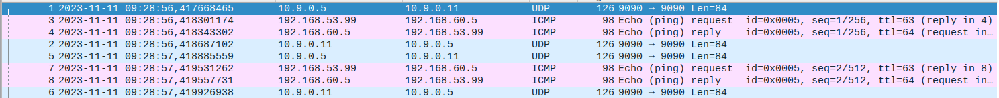

# Task 1: Testing the setup

After setting up the contaienrs using `dcup`

## Host U can communicate with the VPN Server
Get into the container shell of the user machine using `docksh client-10.9.0.5`

Try to `ping` the vpn server

### Result
```
seed@weihong-System-Product-Name:~/Desktop/networksecurtiy_lab/vpn_tunneling$ docksh client-10.9.0.5
root@weihong-1005610:/# ping 10.9.0.11
PING 10.9.0.11 (10.9.0.11) 56(84) bytes of data.
64 bytes from 10.9.0.11: icmp_seq=1 ttl=64 time=0.117 ms
64 bytes from 10.9.0.11: icmp_seq=2 ttl=64 time=0.074 ms
64 bytes from 10.9.0.11: icmp_seq=3 ttl=64 time=0.070 ms
64 bytes from 10.9.0.11: icmp_seq=4 ttl=64 time=0.050 ms
^C
--- 10.9.0.11 ping statistics ---
4 packets transmitted, 4 received, 0% packet loss, time 3061ms
```
From the output, we can tell that the client machine is able to reach the vpn server

## VPN Server can communicate with Host V

We perform the same steps as before.
1. Get into the container shell using `docksh server-router`
2. Try to `ping` Host V at `192.168.60.5`

### Result
```
seed@weihong-System-Product-Name:~/Desktop/networksecurtiy_lab/vpn_tunneling$ docksh server-router
root@weihong-1005610:/# ping 192.168.60.5
PING 192.168.60.5 (192.168.60.5) 56(84) bytes of data.
64 bytes from 192.168.60.5: icmp_seq=1 ttl=64 time=0.120 ms
64 bytes from 192.168.60.5: icmp_seq=2 ttl=64 time=0.064 ms
64 bytes from 192.168.60.5: icmp_seq=3 ttl=64 time=0.071 ms
--- 192.168.60.5 ping statistics ---
3 packets transmitted, 3 received, 0% packet loss, time 2038ms
```
We can see that it is able to reach the Host V machine


## Host U should not be able to communicate with Host V

We perform the same steps as before.
1. Get into the container shell using `docksh client-10.9.0.5`
2. Try to `ping` Host V at `192.168.60.5`

### Result
```
seed@weihong-System-Product-Name:~/Desktop/networksecurtiy_lab/vpn_tunneling$ docksh client-10.9.0.5
root@weihong-1005610:/# ping 192.168.60.5
PING 192.168.60.5 (192.168.60.5) 56(84) bytes of data.
--- 192.168.60.5 ping statistics ---
577 packets transmitted, 0 received, 100% packet loss, time 589803ms
```
from the result we can see that non of the packets got through. Hence Host U cannot communcate with Host V


## VPN Server is able to capture packet on both network

After running `ip address` I get the following output
```
29: eth1@if30: <BROADCAST,MULTICAST,UP,LOWER_UP> mtu 1500 qdisc noqueue state UP group default
    link/ether 02:42:c0:a8:3c:0b brd ff:ff:ff:ff:ff:ff link-netnsid 0
    inet 192.168.60.11/24 brd 192.168.60.255 scope global eth1
       valid_lft forever preferred_lft forever
31: eth0@if32: <BROADCAST,MULTICAST,UP,LOWER_UP> mtu 1500 qdisc noqueue state UP group default
    link/ether 02:42:0a:09:00:0b brd ff:ff:ff:ff:ff:ff link-netnsid 0
    inet 10.9.0.11/24 brd 10.9.0.255 scope global eth0
       valid_lft forever preferred_lft forever
```
which means that the network interface that connects with the client machine is on `eth0` but the network interface connecting the host machines is `eth1`

### Sniff packet on the host network
1. Get into the container shell of the router
2. Run `tcpdump -i eth1 -n`
3. Get into the container shell of the client using `docksh host-192.168.60.5`
4. Send a tcp packet using `nc <destination> <port>` and observe the output on the router shell

#### Result on the router shell
```
root@weihong-1005610:/# tcpdump -i eth1
tcpdump: verbose output suppressed, use -v or -vv for full protocol decode
listening on eth1, link-type EN10MB (Ethernet), capture size 262144 bytes
13:02:05.799775 IP host-192.168.60.5.net-192.168.60.0.53392 > 192.168.0.6.24: Flags [S], seq 926811264, win 64240, options [mss 1460,sackOK,TS val 191604279 ecr 0,nop,wscale 7], length 0
13:02:06.813706 IP host-192.168.60.5.net-192.168.60.0.53392 > 192.168.0.6.24: Flags [S], seq 926811264, win 64240, options [mss 1460,sackOK,TS val 191605293 ecr 0,nop,wscale 7], length 0
13:02:10.909281 ARP, Request who-has weihong-1005610 tell host-192.168.60.5.net-192.168.60.0, length 28
13:02:10.909287 ARP, Reply weihong-1005610 is-at 02:42:c0:a8:3c:0b (oui Unknown), length 28
^C
4 packets captured
4 packets received by filter
0 packets dropped by kernel
```

we can see that the packet is successfully captured

### Sniff packet on the client network
1. Get into the container shell of the router
2. Run `tcpdump -i eth0 -n`
3. Get into the container shell of the client using `docksh client-10.9.0.5`
4. Send a tcp packet using `nc <destination> <port>` and observe the output on the router shell

#### Result on the router shell
```
root@weihong-1005610:/# tcpdump -i eth0
tcpdump: verbose output suppressed, use -v or -vv for full protocol decode
listening on eth0, link-type EN10MB (Ethernet), capture size 262144 bytes
12:58:10.116095 IP client-10.9.0.5.net-10.9.0.0.40992 > weihong-1005610.24: Flags [S], seq 2284596086, win 64240, options [mss 1460,sackOK,TS val 2083271321 ecr 0,nop,wscale 7], length 0
12:58:10.116121 IP weihong-1005610.24 > client-10.9.0.5.net-10.9.0.0.40992: Flags [R.], seq 0, ack 2284596087, win 0, length 0
12:58:13.372795 IP weihong-System-Product-Name.mdns > mdns.mcast.net.mdns: 0 [2q] PTR (QM)? _ipps._tcp.local. PTR (QM)? _ipp._tcp.local. (45)
^C
3 packets captured
3 packets received by filter
0 packets dropped by kernel
```

we can see that the packet is successfully captured


# Task 2: Create and Configure a TUN Interface

## Task 2.a Name of the Interface

### Output from the tun.py
```
root@weihong-1005610:/volumes# tun.py
Interface Name: tun0

```

### Output from `ip address`

```
root@weihong-1005610:/# ip address
1: lo: <LOOPBACK,UP,LOWER_UP> mtu 65536 qdisc noqueue state UNKNOWN group default qlen 1000
    link/loopback 00:00:00:00:00:00 brd 00:00:00:00:00:00
    inet 127.0.0.1/8 scope host lo
       valid_lft forever preferred_lft forever
2: tun0: <POINTOPOINT,MULTICAST,NOARP> mtu 1500 qdisc noop state DOWN group default qlen 500
    link/none
23: eth0@if24: <BROADCAST,MULTICAST,UP,LOWER_UP> mtu 1500 qdisc noqueue state UP group default
    link/ether 02:42:0a:09:00:05 brd ff:ff:ff:ff:ff:ff link-netnsid 0
    inet 10.9.0.5/24 brd 10.9.0.255 scope global eth0
       valid_lft forever preferred_lft forever
```

### Changes in the code
We change the line 
```python
ifr = struct.pack('16sh', b'tun%d', IFF_TUN | IFF_NO_PI)
```
to

```python
ifr = struct.pack('16sh', b'tun', IFF_TUN | IFF_NO_PI)
```
so that the the number does not get filled in by the system

#### Result
```

root@weihong-1005610:/volumes# tun.py
Interface Name: tun

3: tun: <POINTOPOINT,MULTICAST,NOARP> mtu 1500 qdisc noop state DOWN group default qlen 500
    link/none

```
## Task 2.b Setup the TUN interface

### Adding code to bind address and bring up the interface
added the following lines of code to the `tun.py`
```python
os.system("ip addr add 192.168.53.99/24 dev {}".format(ifname))
os.system("ip link set dev {} up".format(ifname))
```

### Result
```
4: tun: <POINTOPOINT,MULTICAST,NOARP,UP,LOWER_UP> mtu 1500 qdisc fq_codel state UNKNOWN group default qlen 500
    link/none
    inet 192.168.53.99/24 scope global tun
       valid_lft forever preferred_lft forever
```

We can see that as compared to the previous output, there is a `inet 192.168.53.99/24` which is the address that we specified and the `valid_lft forever preferred_lft forever` means it has a infinite lifetime


## Task 2.c Read from the TUN interface

adding the following code to the tun.py to read from the interface
```python
while True:
   # Get a packet from the tun interface
   packet = os.read(tun, 2048)
if packet:
   ip = IP(packet)
   print(ip.summary())
```
### Result
#### Pinging `192.168.53.100`
```
root@weihong-1005610:/volumes# tun.py
Interface Name: tun
IP / ICMP 192.168.53.99 > 192.168.53.100 echo-request 0 / Raw
IP / ICMP 192.168.53.99 > 192.168.53.100 echo-request 0 / Raw
IP / ICMP 192.168.53.99 > 192.168.53.100 echo-request 0 / Raw
```

after pinging from the host U to a host on the subnet, the activity is captured and the source is from `192.168.53.99` which is the ip address of the TUN interface

#### Pinging `192.168.60.100`
```
root@weihong-1005610:/volumes# tun.py
Interface Name: tun
```
There is no packet captured since the host on `192.168.60.100` is not under the same network with the `tun` interface. The program above is configure to read only from the `tun` interface in `packet = os.read(tun,2048)`

## Task 2.d Write to the TUN interface

We modfiy the `tun.py` such that 
1. After getting a packet from the TUN interface,if this packet is an ICMP echo request packet,construct a corresponding echo reply packet and write it to the TUN interface. Please provide evidence to show that the code works as expected.
```python
while True:
   # Get a packet from the tun interface
    packet = os.read(tun, 2048)
    if packet:
        ip = IP(packet)
        if ip.haslayer(ICMP) and ip[ICMP].type == 8:  # ICMP Echo Request
            # Create an ICMP Echo Reply packet
            echo_reply = IP(src=ip[IP].dst, dst=ip[IP].src)/ICMP(type=0, id=ip[ICMP].id, seq=ip[ICMP].seq)/ip[Raw].load
            # Write the reply to the TUN interface
            os.write(tun, bytes(echo_reply))
            print("Replied to ICMP Echo Request with Echo Reply")
```
### prove
after running the ping command 
```language
root@weihong-1005610:/# ping  192.168.53.100
PING 192.168.53.100 (192.168.53.100) 56(84) bytes of data.
64 bytes from 192.168.53.100: icmp_seq=1 ttl=64 time=1.89 ms
64 bytes from 192.168.53.100: icmp_seq=2 ttl=64 time=1.64 ms
^C
--- 192.168.53.100 ping statistics ---
2 packets transmitted, 2 received, 0% packet loss, time 1002ms
```
we can see that the icmp packet is getting a reply message, but there is no such machine running on the network, which means our code is drafing the reply message and working as intended

2. Instead of writing an IP packet to the interface, write some arbitrary data to the interface, and report your observation.
```python
while True:
   # Get a packet from the tun interface
    packet = os.read(tun, 2048)
    if packet:
        ip = IP(packet)
        if ip.haslayer(ICMP) and ip[ICMP].type == 8:  # ICMP Echo Request
            os.write(tun,b'hi')
```

we write a `hi` message directly to the tun interface when we receive a ICMP request
### Result
```
root@weihong-1005610:/# ping  192.168.53.100
PING 192.168.53.100 (192.168.53.100) 56(84) bytes of data.
^C
--- 192.168.53.100 ping statistics ---
118 packets transmitted, 0 received, 100% packet loss, time 119804ms
```
the packet that is not a properly constructed ip packet will be ignored and hence no response on the icmp request

# Task 3: Send the IP packet to VPN server through a tunnel
## tun_server.py
```python
#!/usr/bin/env python3
from scapy.all import *
IP_A = "0.0.0.0"
PORT = 9090
sock = socket.socket(socket.AF_INET, socket.SOCK_DGRAM)
sock.bind((IP_A, PORT))
while True:
   data, (ip, port) = sock.recvfrom(2048)
   print("{}:{} --> {}:{}".format(ip, port, IP_A, PORT))
   pkt = IP(data)
   print("   Inside: {} --> {}".format(pkt.src, pkt.dst))
```

## tun_client.py
```python
## <rest of the previous code>
SERVER_IP = "10.9.0.11"
SERVER_PORT = 9090

sock = socket.socket(socket.AF_INET, socket.SOCK_DGRAM)
while True:
    packet = os.read(tun, 2048)
    if packet:
        # Send the packet via the tunnelsock
        sock.sendto(packet, (SERVER_IP, SERVER_PORT))
```

## Result
```
root@weihong-1005610:/volumes# tun_server.py
10.9.0.5:50048 --> 0.0.0.0:9090
   Inside: 192.168.53.99 --> 192.168.53.100
```

When the tun interface receive the ICMP packet, it sends directly to the router's ip via websocket at port 9090

## Pinging Host V
when we run `ping 192.168.60.5`
There is no output on the server side, this is because `192.168.60.5` is not in the subnet of the tun interface that the `tun_client.py` is listening to. Hence the ICMP packet is not captured by the client and not send to the server.

### Solution
We need to route the request to the private network under `192.168.60.0/24` to use the tun interface

We can do that using the following command on Host U
`ip route add 192.168.60.0/24 dev tun via 192.168.53.99`

### Prove
#### Host U output
```
root@weihong-1005610:/# ip route add 192.168.60.0/24 dev tun via 192.168.53.99
root@weihong-1005610:/# ping  192.168.60.5
PING 192.168.60.5 (192.168.60.5) 56(84) bytes of data.
^C
--- 192.168.60.5 ping statistics ---
2 packets transmitted, 0 received, 100% packet loss, time 1010ms
```

#### Router output
```
root@weihong-1005610:/volumes# tun_server.py
10.9.0.5:50048 --> 0.0.0.0:9090
   Inside: 192.168.53.99 --> 192.168.60.5
10.9.0.5:50048 --> 0.0.0.0:9090
   Inside: 192.168.53.99 --> 192.168.60.5
```
we can see that the pack that is sent from `192.168.53.99` to `192.168.60.5` is successfully received 


# Task 4: Setup the VPN server
## Server code
we will need to:
1. Create a TUN interface and configure it 
2. Get the data from the socket interface, treat the received data as an IP packet
3. write the packet to the TUN interface
```python
#!/usr/bin/env python3
import fcntl
import struct
import os
import time
from scapy.all import *

TUNSETIFF = 0x400454ca
IFF_TUN   = 0x0001
IFF_TAP   = 0x0002
IFF_NO_PI = 0x1000

# Create the tun interface
tun = os.open("/dev/net/tun", os.O_RDWR)
ifr = struct.pack('16sH', b'tun', IFF_TUN | IFF_NO_PI)
ifname_bytes  = fcntl.ioctl(tun, TUNSETIFF, ifr)

# Get the interface name
ifname = ifname_bytes.decode('UTF-8')[:16].strip("\x00")
print("Interface Name: {}".format(ifname))

os.system("ip addr add 192.168.54.100/24 dev {}".format(ifname))
os.system("ip link set dev {} up".format(ifname))

IP_A = "0.0.0.0"
PORT = 9090
sock = socket.socket(socket.AF_INET,socket.SOCK_DGRAM)
sock.bind((IP_A, PORT))
while True:
    data, (ip, port) = sock.recvfrom(2048)
    print("{}:{} --> {}:{}".format(ip, port, IP_A, PORT))
    pkt = IP(data)
    print("   Inside: {} --> {}".format(pkt.src, pkt.dst))

    os.write(tun,bytes(pkt))
```

we setup the tun interface just like how we setup on the client side and use `os.write(tun,bytes(pkt))` to write the IP packets received to the tun interface

## Prove
We can run `tcpdump -i tun -n` to sniff the packet through the `tun` interface on the Host V machine
```
root@weihong-1005610:/# tcpdump -i eth0 -n
tcpdump: verbose output suppressed, use -v or -vv for full protocol decode
listening on eth0, link-type EN10MB (Ethernet), capture size 262144 bytes
15:27:30.921389 IP 192.168.53.99 > 192.168.60.5: ICMP echo request, id 20, seq 1, length 64
15:27:30.921413 IP 192.168.60.5 > 192.168.53.99: ICMP echo reply, id 20, seq 1, length 64
15:27:31.934501 IP 192.168.53.99 > 192.168.60.5: ICMP echo request, id 20, seq 2, length 64
15:27:31.934521 IP 192.168.60.5 > 192.168.53.99: ICMP echo reply, id 20, seq 2, length 64
15:27:36.157635 ARP, Request who-has 192.168.60.11 tell 192.168.60.5, length 28
15:27:36.157687 ARP, Request who-has 192.168.60.5 tell 192.168.60.11, length 28
15:27:36.157691 ARP, Reply 192.168.60.5 is-at 02:42:c0:a8:3c:05, length 28
15:27:36.157693 ARP, Reply 192.168.60.11 is-at 02:42:c0:a8:3c:0b, length 28
```
We can see that the ICMP packet is successfully received at the host V machine

# Task 5: Handling Traffic in both direction

we will modify the code of both server and client files to use select to accept request coming from both directions

```python
# tun_client.py
# <rest fo the code to setup the tun file descriptor>
IP_A = "0.0.0.0"
PORT = 9090
sock = socket.socket(socket.AF_INET,socket.SOCK_DGRAM)
sock.bind((IP_A, PORT))
os.system("ip route add 192.168.60.0/24 dev tun via 192.168.53.99")
while True:
    ready, _, _ = select.select([sock, tun], [], [])
    for fd in ready:
        if fd is sock:
            data, (ip, port) = sock.recvfrom(2048)
            pkt = IP(data)
            print("From socket <==: {} --> {}".format(pkt.src, pkt.dst))
            os.write(tun,bytes(pkt))
        if fd is tun:
            packet = os.read(tun,2048)
            pkt = IP(packet)
            print("From tun    ==>: {} --> {}".format(pkt.src, pkt.dst))
            sock.sendto(packet, (SERVER_IP, PORT))
```

We will first need to route the request to the private network at `192.168.60.0/24` through the tun interface. 
The program will then watch of data coming into the file descriptor, if there is a packet come through the tun interface, the packet is send through the socket to the VPN server.
If a packet receive a packet from the socket, this packet will then be written to the tun interface and be executed.

```python
# tun_server.py
os.system("ip route add 192.168.53.0/24 dev tun ")
while True:
    ready, _, _ = select.select([sock, tun], [], [])
    for fd in ready:
        if fd is sock:
            data, (ip, port) = sock.recvfrom(2048)
            pkt = IP(data)
            print("From socket <==: {} --> {}".format(pkt.src, pkt.dst))
            os.write(tun,bytes(pkt))
        if fd is tun:
            packet = os.read(tun,2048)
            pkt = IP(packet)
            print("From tun    ==>: {} --> {}".format(pkt.src, pkt.dst))
            sock.sendto(packet, (SERVER_IP, PORT))
```
The concept is the same is just the route that is added is different, we will be routing the request to the client's `tun` interface through the server's tun interface

## Result
After we try to ping Host V from Host U, we can see that the ICMP request is able to go through and receives a reply.
```language
root@weihong-1005610:/# ping 192.168.60.5
PING 192.168.60.5 (192.168.60.5) 56(84) bytes of data.
64 bytes from 192.168.60.5: icmp_seq=1 ttl=63 time=2.08 ms
64 bytes from 192.168.60.5: icmp_seq=2 ttl=63 time=2.12 ms
64 bytes from 192.168.60.5: icmp_seq=3 ttl=63 time=2.14 ms
^C
--- 192.168.60.5 ping statistics ---
3 packets transmitted, 3 received, 0% packet loss, time 2002ms
rtt min/avg/max/mdev = 2.078/2.113/2.142/0.026 ms
```

### Wireshark

From the image, we can tell that the UDP packet containing the ICMP request  first go from Host U to the VPN router, `10.9.0.5` to `10.9.0.11`
Then the ICMP packet is sent with in the network interface of `192.168.60.0/24` from `192.168.53.99` which is the tun interface IP of the Host U, to `192.168.60.5` which is the IP of the Host V

After Host V receives the ICMP request, it sends a ICMP reply back to the `192.168.53.99` which is then routed by the program to the tun interface on the server, which packages the program and send to the destination IP of Host U at `10.9.0.5` using a UDP packet


# Task 6: Tunnel-breaking Experiment
After establishing a `telnet` connection and break the tunnel by stopping the program
When i stop the server program,when i try to type something in the telnet connection, it does not get registered in the telnet session, but i can see that packets are coming through the client program. The connection is not broken
I bring up the server program again and wait for 1-2 seconds, whatever that I have typed before gets sent over to the server program all at ones and the telnet program registered my previously typed keystrokes. 

This is because the tunnel is re-established before the TCP timeout and the TCP's retransmission mechanism will resume trying to send unacknowledged packets. If the tunnel is down for too long and the TCP timeout is exceeded, the telnet session will be terminated
