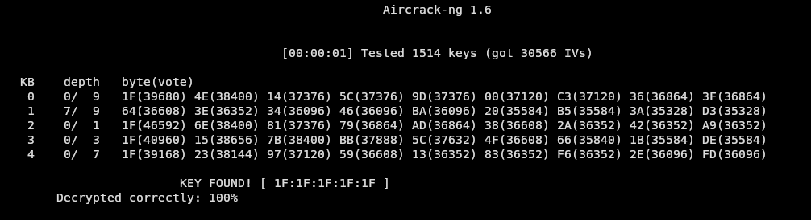
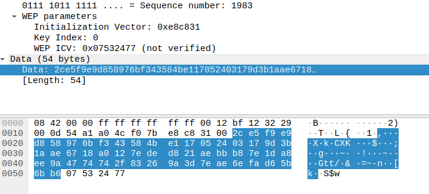

# Task 1:Cracking the WEP password

Given the command and the cap file, get the following output

We can see that the WEP password is `1F:1F:1F:1F:1F`

# Task 2: Cracking the WEP packet

## Implement the RC4 algorithm
```python
import binascii
import struct


def KSA(key):
    S = list(range(256))
    j = 0
    for i in range (256):
        j = (j+S[i]+key[i%len(key)])%256
        S[i],S[j] = S[j],S[i]
    

    # Add KSA implementation Here
    
    return S

def PRGA(S):
    K = 0
    # Add PRGA implementation here
    i = 0
    j = 0
    while True:
        i = (i+1)%256
        j = (j+S[i])%256
        S[i],S[j] = S[j],S[i]
        K = S[(S[i]+ S[j])%256]

        yield K

def RC4(key):
    S = KSA(key)
    return PRGA(S)


def test_RC4(key, ciphertext):
    key = binascii.unhexlify(key)
    ciphertext = binascii.unhexlify(ciphertext)

    keystream = RC4(key)

    plaintext = "".join('{:02X}'.format(c ^ next(keystream)) for c in ciphertext)

    return plaintext

if __name__ == '__main__':
    # RC4 algorithm please refer to http://en.wikipedia.org/wiki/RC4

    ## key = a list of integer, each integer 8 bits (0 ~ 255)
    ## ciphertext = a list of integer, each integer 8 bits (0 ~ 255)
    ## binascii.unhexlify() is a useful function to convert from Hex string to integer list

    ## Use RC4 to generate keystream
    test_cases = [

        ('1A2B3C', '00112233'),

        ('000000', '00112233'),

        ('012345', '00112233')

    ]
    test_results = {test_case: test_RC4(*test_case) for test_case in test_cases}

    print(test_results)
    
```

After running `python3 skeleton.py` we will get the following output
```
{('1A2B3C', '00112233'): '0F6D13BC', ('000000', '00112233'): 'DE09AB72', ('012345', '00112233'): '6F914F8F'}
```
Which shows that our RC4 works as intended

## cracked payload and ICV
The packet that we want to crack is show below:

We can see that the row data is `2cef9e...` and the IV is `e8c831` and the ICV for this packet is `07532477`
Using these information together with the `WEP KEY` that we found in task 1, we can crack the payload

update the main function with the following code
```python
data ='2ce5f9e9d858976bf343584be117052403179d3b1aae6718a0127eded821aebbb87e1da8ee9a4774742f83269a3d7eae6efad65b6bb6'
wep_key = '1F1F1F1F1F'
IV = "e8c831"
expected_ICV = "0x07532477"

print(f"Cracking packet with:\nencrypted data:{data}\nwep key:{wep_key}\nIV:{IV}\nThe expected ICV value:{expected_ICV}")

rc4_key = IV + wep_key

decrypted_data = test_RC4(rc4_key, data)


# Calculate the CRC32 of the decrypted data
crcle = binascii.crc32(bytes.fromhex(decrypted_data)) & 0xffffffff
crc = struct.pack('<L', crcle)

crc_plaintext = binascii.hexlify(crc).decode('utf-8')


## Check ICV
concat_plaintext = decrypted_data+crc_plaintext
new_cipher = test_RC4(rc4_key,concat_plaintext)
print("==================Cracking result========================")
print(f"The plain text is {decrypted_data}")
print(f"The ICV for the encrypted text is {new_cipher[-8:]}")

```
### Code Explanation


1. **Data and Key Information**:
   - `data`: This is the encrypted data that needs to be decrypted.
   - `wep_key`: A key used in the WEP encryption process. It is usually a hexadecimal string.
   - `IV` (Initialization Vector): A short string used to add randomness to the encryption process.
   - `expected_ICV`: Expected Integrity Check Value, used to verify the integrity of the decrypted data.

2. **Formation of RC4 Key**:
   - The code combines the `IV` and the `wep_key` to form the RC4 key. RC4 is a stream cipher used in WEP encryption.

3. **Decryption Process**:
   - `decrypted_data = test_RC4(rc4_key, data)`: This line suggests the use of an RC4 decryption function (`test_RC4`) that takes the RC4 key and the encrypted data to produce the decrypted data.

4. **CRC32 Calculation**:
   - CRC32 (Cyclic Redundancy Check) is calculated on the decrypted data. CRC32 is a hashing algorithm that helps in detecting errors in data.
   - The CRC32 value is calculated in a little-endian format (`'<L'` in `struct.pack`) and then converted to a hexadecimal string.

5. **Integrity Check Value (ICV) Verification**:
   - The decrypted data is concatenated with the CRC32 value to form a new plaintext.
   - This new plaintext is then encrypted using the same RC4 key.
   - The last 8 characters of this new cipher are the ICV for the encrypted text. This is compared with the expected ICV to check the integrity of the decrypted data.

### Output
```
Cracking packet with:
encrypted data:2ce5f9e9d858976bf343584be117052403179d3b1aae6718a0127eded821aebbb87e1da8ee9a4774742f83269a3d7eae6efad65b6bb6
wep key:1F1F1F1F1F
IV:e8c831
The expected ICV value:0x07532477
==================Cracking result========================
The plain text is AAAA0300000008060001080006040001000EA66BFB69AC100001000000000000AC1000F0000000000000000000000000000000000000
The ICV for the encrypted text is 07532477
```
We can see that the payload is successfully cracked and the ICV that we have gotten is the same as the one we are expecting, which further proves that the plain text is decrypted correctly